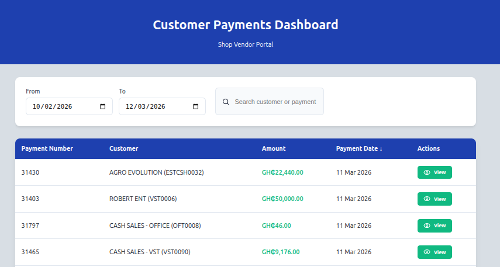
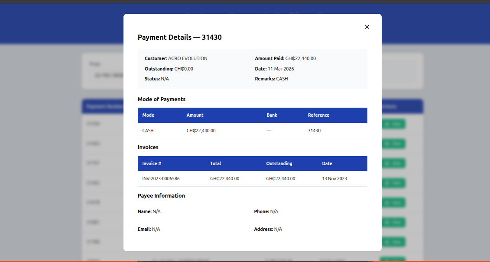

# Customer Payments Web Application

A web application showing a grid/table for a shop
vendor to view payments received from Customer.



## Features

- Real-time table from an `API`
- Date range filter + search + sorting
- Modal with full details (ModeOfPayments, invoices, Payee)
- Keyboard Navigation
- Fully responsive + accessible
- CORS handled via Netlify TOML



---

## Known Issues

- Closing the modal with `ESC` key does not work
- Closing the modal with `Enter` key causes a re-render of the modal view even though stopPropagation is initialized after keypress.

---

## Step-by-Step Local Setup

### 1. Prerequisite Check

Ensure you have **Node.js** (v18 or higher) and **pnpm** or **npm** installed on your machine. You can verify this by running `node -v` in your terminal.

### 2. Clone the Repository

Open your terminal or command prompt and run the following commands:

```bash
# Clone the repository
git https://github.com/joe-boadi/payment-dashboard.git

# Navigate into the project directory
cd payments-dashboard

```

### 3. Install Dependencies

This project uses **Vite** for a performant development experience and **Lucide React** for iconography.

```bash
pnpm install

```

### 4. Configure Environment Variables

Create a file named `.env` in the root directory. This separates your configuration from your logic, which is a best practice for API management.

```env
# The proxy path defined in vite.config.js
VITE_API_PATH=/api/Payments

```

### 5. Run the Application

Start the Vite development server:

```bash
pnpm run dev

```

Once the server starts, open your browser to **http://localhost:5173**.

---

## 🛠 Project Architecture & Strategy

### Folder Structure

- **`/src/utils/`**: Contains `fetch-payments.js`. This is where the core logic for hitting the GET requests to `API` resides as well related utils for robust data handling.

- **`/src/components/`**: Houses the `PaymentTable`, `PaymentModal`, and `Filters`. Each component is designed for **Responsiveness** and **Accessibility**.

- **`/src/App.css`**: Centralized CSS with variables for consistent branding.

### Technical Trade-offs & Decisions

## CORS Management

- **Local development**: Uses .env for storing the API url or fallback directly in the `/utils` directory for seamless API access.
- **Production (Netlify)**: Uses `netlify.toml` redirects to proxy all API requests through Netlify’s edge network, completely eliminating CORS issues.

- **Vanilla CSS**: To keep the bundle size small and highly performant, modern vanilla CSS (Flexbox/Grid) was used instead of heavy UI libraries.

## Code Formatting

This project uses **Prettier** to ensure consistent indentation, quotes, semicolons, and style across all files.

Before every commit or push, run:

```bash
npm run format
```

### Edge Case Handling & Fallbacks

The application is designed to handle missing data gracefully:

- **Missing Fields**: If a `Customer` or `Payment Number` is missing, an em-dash (`—`) or `N/A` is displayed.

- **Loading State**: While the payment-data is being fetched (triggered as user launches the app), a `Loader component` indicator provides immediate feedback, same applies to requesting payment details.

- **Error Fallback Page**: When there is any request error, application falls into an error-page UI component which also provides immediate feedback.

- **Mobile View**: The table automatically adjust to the layout for screens smaller than **768px** to ensure a professional user experience.

---

## Technologies

- React.js + Vite
- Vanilla CSS
- Prettier
- Lucide React Icons
- PropTypes
